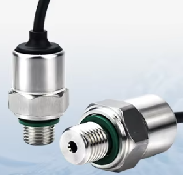

XDB-401 Pressure Sensor
===========================================

.. seo::
    :description: Instructions for setting up XDB-401 pressure sensors with ESPHome
    :image: xdb401.png
    :keywords: XDB-401 XDB401

The ``xdb401`` sensor platform allows you to use your XDB-401 (`product page <https://www.xdbsensor.com/xdb401-industrial-piezoresistive-pressure-sensor-product/>`__) pressure sensors with ESPHome.

    XDB-401 Pressure Sensor.

Configuration
-------------
:ref:`I²C <i2c>` bus is required to be set up in your configuration for this sensor to work.

.. code-block:: yaml

    # Example configuration entry
    sensor:
      - platform: xdb401
        pressure:
          name: "Pressure"
        temperature:
          name: Temperature

Configuration variables
-----------------------

- **pressure** (*Optional*): The information for the pressure sensor. Readings in pacals (Pa). See :ref:`xdb401-converting`.

 - All other options from :ref:`Sensor <config-sensor>`.

- **temperature** (*Optional*): The information for the temperature sensor. Readings in degrees celsius (°C).

 - All other options from :ref:`Sensor <config-sensor>`.

- **i2c_id** (*Optional*, :ref:`config-id`): Manually specify the ID of the :ref:`I²C Component <i2c>`. Defaults to the default I²C bus.

- **address** (*Optional*, int): Manually specify the I²C address of the sensor.
  All known sensors currently configured to ``0x7F``. Defaults to ``0x7F``.

.. _xdb401-converting:

Converting units
-----------------

The XDB-401 pressure sensor claims to be calibrated and integration scales result to Pascal's.
But depending on model and configuration, the sensor can be output different ranges of pressure.
For best application results, the sensor should be calibrated to the specific range of pressure you are using.

.. Estimated
.. *********

.. Use ``calibrate_linear`` filter to map these sensor values:

.. .. code-block:: yaml

..     # Extract of configuration
..     filters:
..       - calibrate_linear:
..         - 1638 -> 0.5
..         - 14746 -> 4.5

Calibrated
**********
1. Expose the sensor to a low known pressure, for example ``3 447`` Pa (0.5 psi).
2. Observe the value of the raw pressure sensor, for example ``3 500`` Pa.
3. Expose the sensor to a high pressure, for example ``20 684`` Pa (3 psi).
4. Observe the value of the raw pressure sensor, for example ``20 500`` Pa.
5. Use ``calibrate_linear`` filter to map the incoming value to the calibrated one:

.. code-block:: yaml

    # Extract of configuration
    filters:
      - calibrate_linear:
        - 3500 -> 3447
        - 20500 -> 20684

Scaling / converting units
**************************

The XDB-401 pressure sensor is by default set to output pressure in Pascal's (Pa).
To convert to other units, you can use the ``scale`` filter.
For example, to convert to psi:

.. code-block:: yaml

    # Extract of configuration
    unit_of_measurement: "psi"
    filters:
      - scale: 0.000145037738

Notes
-----

The XDB-401 I²C has a temperature output, however the manufacturer does
not specify its accuracy on the published datasheet. They indicate
that the sensor should not be used as a calibrated temperature
reading; it’s only intended for curve fitting data during
compensation.

See Also
--------

- :ref:`sensor-filters`
- `XDB-401 Product Page <https://www.xdbsensor.com/xdb401-industrial-piezoresistive-pressure-sensor-product/>`__
- :ghedit:`Edit`
